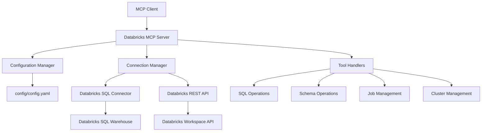

# Design Document

## Overview

The Databricks MCP server will be implemented as a Python-based Model Context Protocol server that provides programmatic access to Databricks functionality. It will follow the same architectural patterns as the existing SQL Server MCP, using the `databricks-sql-connector` library for database operations and the Databricks REST API for cluster and job management.

The server will be designed as a single-file Python module (`Databricks_MCP.py`) that can be run as a standalone MCP server, reading configuration from the existing `config/config.yaml` file and providing a comprehensive set of tools for Databricks operations.

## Architecture

### High-Level Architecture



### Component Responsibilities

- **Configuration Manager**: Loads and validates Databricks configuration from YAML
- **Connection Manager**: Handles SQL connections and REST API authentication
- **Tool Handlers**: Implements individual MCP tools for different operations
- **SQL Operations**: Executes queries and manages data operations
- **Schema Operations**: Provides metadata and schema exploration
- **Job Management**: Handles Databricks job operations
- **Cluster Management**: Manages cluster information and status

## Components and Interfaces

### 1. Configuration Management

```python
class DatabricksConfig:
    server_hostname: str
    http_path: str
    access_token: str
    catalog: str
    schema: str
    
def load_config() -> DatabricksConfig:
    """Load configuration from config/config.yaml"""
```

### 2. Connection Management

```python
class ConnectionManager:
    def get_sql_connection() -> databricks.sql.Connection
    def get_rest_client() -> requests.Session
    def validate_connection() -> bool
```

### 3. MCP Tools Interface

The server will implement the following MCP tools:

#### Core SQL Operations
- `execute_query`: Execute SQL queries (SELECT, INSERT, UPDATE, DELETE, DDL)
- `execute_statement`: Execute non-query statements with detailed results

#### Schema and Metadata Operations
- `list_catalogs`: List available catalogs
- `list_schemas`: List schemas in a catalog
- `list_tables`: List tables in a catalog.schema
- `get_table_schema`: Get detailed table schema information
- `describe_table`: Get comprehensive table metadata

#### Data Management Operations
- `create_table`: Create new tables with various options
- `insert_data`: Insert structured data into tables
- `create_view`: Create views from SQL queries

#### Cluster and Job Operations
- `list_clusters`: List available compute clusters
- `get_cluster_status`: Get cluster state and information
- `list_jobs`: List Databricks jobs
- `run_job`: Trigger job execution
- `get_job_run_status`: Check job run status

### 4. Tool Implementation Pattern

Each tool will follow this consistent pattern:

```python
async def tool_handler(arguments: Dict[str, Any]) -> str:
    try:
        # Validate arguments
        # Execute operation
        # Return structured JSON response
        return json.dumps({
            "success": True,
            "data": result_data,
            "metadata": additional_info
        }, indent=2)
    except Exception as e:
        return json.dumps({
            "success": False,
            "error": str(e),
            "error_type": type(e).__name__
        }, indent=2)
```

## Data Models

### 1. Query Result Model
```python
{
    "success": bool,
    "columns": List[str],
    "data": List[Dict[str, Any]],
    "row_count": int,
    "execution_time": float
}
```

### 2. Table Schema Model
```python
{
    "catalog": str,
    "schema": str,
    "table_name": str,
    "table_type": str,
    "columns": [
        {
            "column_name": str,
            "data_type": str,
            "is_nullable": bool,
            "comment": str,
            "partition_key": bool
        }
    ],
    "location": str,
    "format": str
}
```

### 3. Job Information Model
```python
{
    "job_id": int,
    "job_name": str,
    "job_type": str,
    "creator": str,
    "created_time": str,
    "settings": Dict[str, Any]
}
```

### 4. Cluster Information Model
```python
{
    "cluster_id": str,
    "cluster_name": str,
    "state": str,
    "node_type_id": str,
    "num_workers": int,
    "spark_version": str,
    "runtime_engine": str
}
```

## Error Handling

### 1. Connection Errors
- Handle authentication failures with clear messages
- Manage network timeouts and retries
- Validate configuration parameters

### 2. SQL Execution Errors
- Parse and format Databricks SQL error messages
- Handle syntax errors with line number information
- Manage permission and access control errors

### 3. API Errors
- Handle REST API rate limiting
- Manage resource not found errors
- Process malformed request errors

### 4. Error Response Format
```python
{
    "success": False,
    "error": "Human-readable error message",
    "error_type": "ExceptionClassName",
    "error_code": "DATABRICKS_ERROR_CODE",
    "details": {
        "operation": "operation_name",
        "parameters": {...}
    }
}
```

## Testing Strategy

### 1. Unit Tests
- Test configuration loading and validation
- Test connection management with mocked responses
- Test individual tool handlers with sample data
- Test error handling scenarios

### 2. Integration Tests
- Test actual Databricks connections using test credentials
- Validate SQL query execution against test tables
- Test job and cluster operations in development environment
- Verify MCP protocol compliance

### 3. Test Data Setup
- Create test catalog and schema in Databricks
- Set up sample tables with various data types
- Configure test jobs and clusters for API testing
- Prepare test datasets for insertion operations

### 4. Test Configuration
```yaml
# test_config.yaml
databricks:
  server_hostname: "test-workspace.cloud.databricks.com"
  http_path: "/sql/1.0/warehouses/test-warehouse"
  access_token: "test-token"
  catalog: "test_catalog"
  schema: "test_schema"
```

## Dependencies

### Required Python Packages
- `databricks-sql-connector`: For SQL operations
- `requests`: For REST API calls
- `pyyaml`: For configuration file parsing
- `mcp`: For MCP protocol implementation
- `asyncio`: For asynchronous operations

### Development Dependencies
- `pytest`: For unit testing
- `pytest-asyncio`: For async test support
- `responses`: For mocking HTTP requests
- `black`: For code formatting
- `mypy`: For type checking

## Security Considerations

### 1. Credential Management
- Access tokens stored in configuration files (not hardcoded)
- Support for environment variable overrides
- Secure connection handling with HTTPS

### 2. Query Safety
- Input validation for SQL queries
- Protection against SQL injection through parameterized queries
- Rate limiting for expensive operations

### 3. Access Control
- Respect Databricks workspace permissions
- Handle unauthorized access gracefully
- Log security-related events appropriately

## Performance Considerations

### 1. Connection Pooling
- Reuse SQL connections where possible
- Implement connection timeout handling
- Manage connection lifecycle properly

### 2. Query Optimization
- Support for query result limiting
- Efficient handling of large result sets
- Streaming results for large queries

### 3. Caching Strategy
- Cache schema information for performance
- Implement TTL for cached metadata
- Clear cache on schema changes