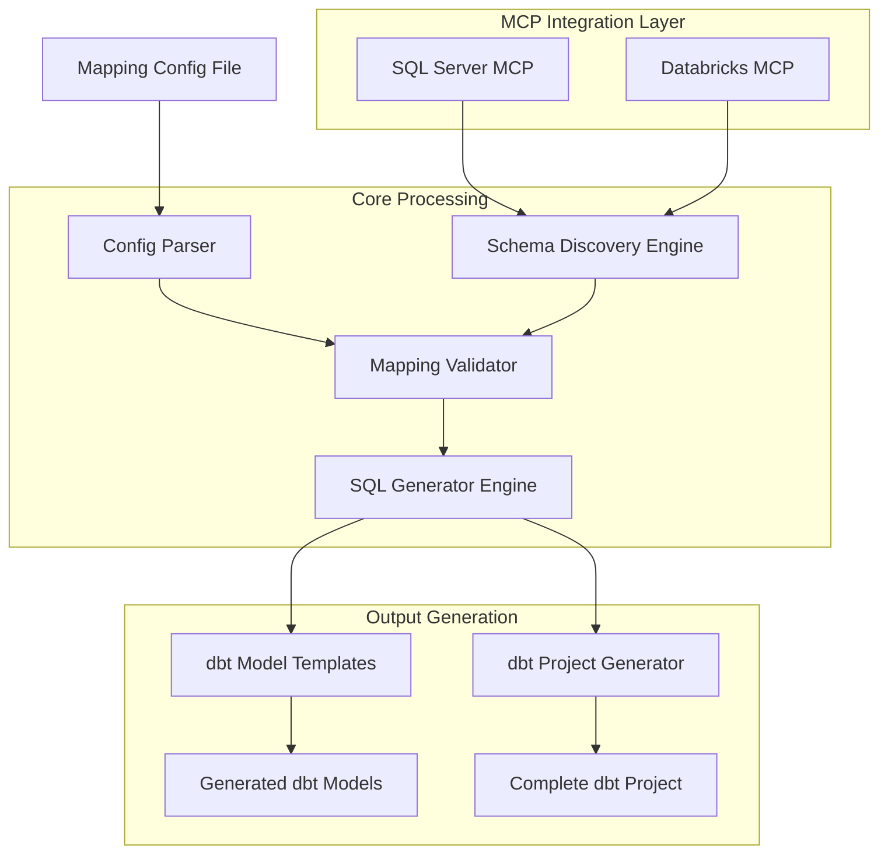

# Design Document

## Overview

The dbt SQL Generator is a Python-based system that automates the creation of dbt models for data migration from SQL Server to Databricks. It leverages existing MCP servers to discover schemas, processes mapping configurations, and generates production-ready dbt SQL scripts with proper transformations, incremental loading, and data quality checks.

## Architecture



## Components and Interfaces

### 1. Configuration Management
**Purpose:** Parse and validate mapping configuration files

**Key Classes:**
- `MappingConfig`: Main configuration container
- `TableMapping`: Individual table mapping definition
- `ColumnMapping`: Column-level transformation rules
- `IncrementalConfig`: Incremental loading settings

**Configuration Schema:**
```yaml
project:
  name: "migration_project"
  databricks_catalog: "main"
  databricks_schema: "migrated_data"

sources:
  sql_server:
    connection_name: "sql_server_mcp"
    schema: "dbo"

destinations:
  databricks:
    connection_name: "databricks_mcp"

tables:
  - source_table: "customers"
    destination_table: "dim_customers"
    materialization: "incremental"
    incremental_strategy: "merge"
    unique_key: "customer_id"
    updated_at: "last_modified"
    columns:
      - source: "customer_id"
        destination: "customer_key"
        type: "bigint"
      - source: "customer_name"
        destination: "customer_name"
        transformation: "UPPER(TRIM(customer_name))"
      - source: null
        destination: "created_at"
        default: "current_timestamp()"
```

### 2. MCP Integration Layer
**Purpose:** Interface with existing SQL Server and Databricks MCP servers

**Key Classes:**
- `MCPSchemaDiscovery`: Orchestrates schema discovery across both systems
- `SQLServerSchemaReader`: Wraps SQL Server MCP calls
- `DatabricksSchemaReader`: Wraps Databricks MCP calls
- `SchemaComparator`: Validates mappings against discovered schemas

**Methods:**
```python
class MCPSchemaDiscovery:
    def discover_source_schema(self, table_name: str) -> TableSchema
    def discover_destination_schema(self, table_name: str) -> TableSchema
    def validate_mapping(self, mapping: TableMapping) -> ValidationResult
    def get_sample_data(self, table_name: str, limit: int = 10) -> List[Dict]
```

### 3. SQL Generation Engine
**Purpose:** Generate dbt-compliant SQL models with transformations

**Key Classes:**
- `DBTModelGenerator`: Main SQL generation orchestrator
- `SQLTransformationBuilder`: Builds transformation logic
- `IncrementalLogicBuilder`: Handles incremental loading patterns
- `DataTypeConverter`: Manages SQL Server to Databricks type conversions

**Template Structure:**
```sql
-- Generated dbt model: {{ model_name }}.sql
{{ config(
    materialized='{{ materialization }}',
    unique_key='{{ unique_key }}',
    on_schema_change='{{ schema_change_policy }}'
) }}

WITH source_data AS (
    SELECT
        {{ column_transformations }}
    FROM {{ ref('source_table') }}
    
        WHERE {{ incremental_filter }}
    
)

SELECT * FROM source_data
```

### 4. dbt Project Generator
**Purpose:** Create complete dbt project structure and configuration

**Key Classes:**
- `DBTProjectBuilder`: Orchestrates project creation
- `SourcesGenerator`: Creates sources.yml definitions
- `ProjectConfigGenerator`: Generates dbt_project.yml
- `TestsGenerator`: Creates basic data quality tests

## Data Models

### TableSchema
```python
@dataclass
class TableSchema:
    table_name: str
    schema_name: str
    columns: List[ColumnDefinition]
    primary_keys: List[str]
    indexes: List[IndexDefinition]
    row_count: Optional[int] = None
```

### ColumnDefinition
```python
@dataclass
class ColumnDefinition:
    name: str
    data_type: str
    is_nullable: bool
    max_length: Optional[int] = None
    precision: Optional[int] = None
    scale: Optional[int] = None
    default_value: Optional[str] = None
```

### GeneratedModel
```python
@dataclass
class GeneratedModel:
    model_name: str
    sql_content: str
    config: Dict[str, Any]
    dependencies: List[str]
    tests: List[str]
    documentation: str
```

## Error Handling

### Schema Discovery Errors
- **Connection Failures:** Retry with exponential backoff, fallback to cached schemas
- **Missing Tables:** Clear error messages with suggestions for similar table names
- **Permission Issues:** Detailed error with required permissions list

### Mapping Validation Errors
- **Type Incompatibility:** Suggest compatible type conversions
- **Missing Columns:** List available columns and suggest alternatives
- **Invalid Transformations:** SQL syntax validation with error highlighting

### SQL Generation Errors
- **Template Errors:** Validate Jinja2 templates before processing
- **Syntax Errors:** Use SQL parser to validate generated queries
- **Dependency Issues:** Check for circular dependencies in model references

## Testing Strategy

### Unit Tests
- **Configuration Parsing:** Test YAML parsing with various valid/invalid configs
- **Schema Discovery:** Mock MCP responses and test schema extraction
- **SQL Generation:** Test template rendering with different mapping scenarios
- **Type Conversion:** Validate all SQL Server to Databricks type mappings

### Integration Tests
- **End-to-End Pipeline:** Full workflow from config to generated dbt project
- **MCP Server Integration:** Test actual calls to both MCP servers
- **Generated SQL Validation:** Execute generated SQL against test databases
- **dbt Project Validation:** Run `dbt parse` and `dbt compile` on generated projects

### Performance Tests
- **Large Schema Discovery:** Test with databases containing hundreds of tables
- **Bulk SQL Generation:** Generate models for 50+ table mappings
- **Memory Usage:** Monitor memory consumption during large operations

## Security Considerations

### Credential Management
- Use existing MCP server authentication mechanisms
- Never store credentials in generated dbt models
- Support environment variable references in configurations

### Data Privacy
- Mask sensitive data in sample queries and logs
- Provide options to exclude PII columns from generated models
- Generate data classification tags based on column names/types

### Access Control
- Validate user permissions before schema discovery
- Generate appropriate dbt permissions and grants
- Include security best practices in generated documentation

## Performance Optimizations

### Caching Strategy
- Cache discovered schemas for configurable time periods
- Store generated SQL templates for reuse across similar mappings
- Implement incremental config validation (only validate changed mappings)

### Parallel Processing
- Discover source and destination schemas concurrently
- Generate multiple dbt models in parallel
- Batch MCP server calls for efficiency

### Resource Management
- Limit concurrent MCP connections
- Implement connection pooling for database operations
- Provide progress indicators for long-running operations