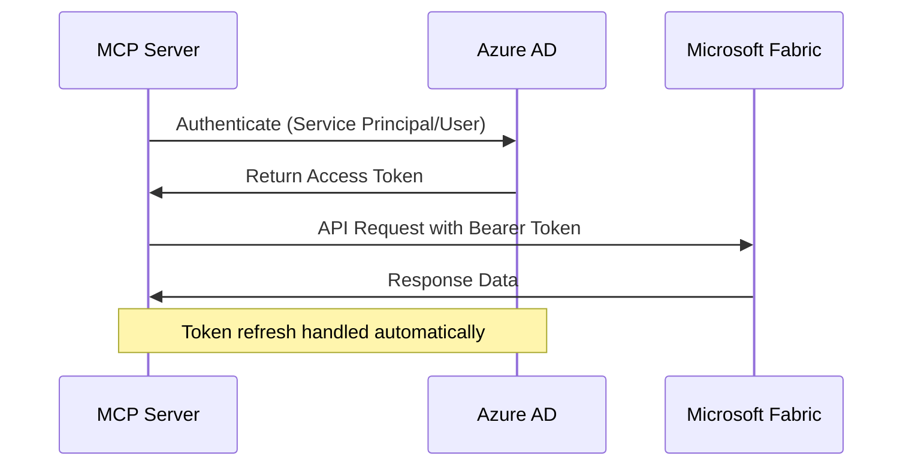
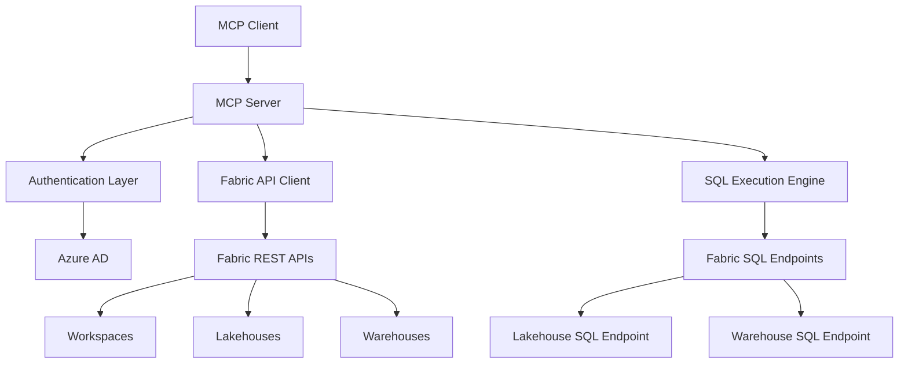

# Design Document

## Overview

The Microsoft Fabric MCP Server will provide a standardized Model Context Protocol interface for interacting with Microsoft Fabric resources. The server will follow the same architectural patterns as the existing Databricks MCP server, providing tools for SQL query execution, resource management, and data operations across Fabric workspaces, lakehouses, and warehouses.

The server will be implemented as a Python-based MCP server using the `mcp` library, with authentication handled through Azure Active Directory (AAD) service principals or user credentials. The design emphasizes consistency with existing MCP servers while accommodating Fabric-specific features and authentication requirements.

## Architecture

### Core Components

1. **MCP Server Framework**
   - Built on the `mcp.server` library
   - Implements standard MCP protocol for tool registration and execution
   - Provides async tool execution with proper error handling

2. **Authentication Layer**
   - Azure Active Directory integration using `azure-identity` library
   - Support for service principal authentication (client ID/secret)
   - Support for user authentication (interactive/device code flow)
   - Token management with automatic refresh capabilities

3. **Fabric API Client**
   - REST API client for Microsoft Fabric operations
   - Built on `requests` or `httpx` for HTTP operations
   - Handles workspace, lakehouse, and warehouse operations
   - Implements retry logic and rate limiting

4. **SQL Execution Engine**
   - Integration with Fabric SQL endpoints
   - Support for both lakehouse and warehouse SQL endpoints
   - Connection pooling and timeout management
   - Query result formatting and error handling

5. **Configuration Management**
   - YAML-based configuration similar to existing servers
   - Environment variable support for sensitive data
   - Validation of required configuration parameters

### Authentication Flow



### Data Flow Architecture



## Components and Interfaces

### Configuration Schema

```yaml
fabric:
  # Authentication configuration
  tenant_id: "your-tenant-id"
  client_id: "your-client-id"
  client_secret: "your-client-secret"  # or use environment variable
  
  # Default workspace and resource settings
  workspace_id: "default-workspace-id"
  default_lakehouse: "default-lakehouse-name"
  default_warehouse: "default-warehouse-name"
  
  # Connection settings
  timeout: 120
  max_retries: 3
  retry_delay: 5
```

### Core Tool Interfaces

1. **Query Execution Tools**
   - `execute_query`: Execute SQL against lakehouse or warehouse
   - `execute_lakehouse_query`: Specific lakehouse SQL execution
   - `execute_warehouse_query`: Specific warehouse SQL execution

2. **Resource Discovery Tools**
   - `list_workspaces`: List accessible workspaces
   - `list_lakehouses`: List lakehouses in workspace
   - `list_warehouses`: List warehouses in workspace
   - `list_tables`: List tables in lakehouse/warehouse
   - `get_table_schema`: Get table schema information

3. **Data Management Tools**
   - `create_table`: Create new table in lakehouse/warehouse
   - `insert_data`: Insert data into existing table
   - `describe_table`: Get comprehensive table metadata

4. **Resource Management Tools**
   - `get_workspace_info`: Get workspace details
   - `get_lakehouse_info`: Get lakehouse details
   - `get_warehouse_info`: Get warehouse details and status

### API Client Interface

```python
class FabricAPIClient:
    def __init__(self, config: Dict[str, Any]):
        self.config = config
        self.session = None
        self.token_credential = None
    
    async def authenticate(self) -> bool:
        """Authenticate with Azure AD and get access token"""
        pass
    
    async def get_workspaces(self) -> List[Dict]:
        """Get list of accessible workspaces"""
        pass
    
    async def get_lakehouses(self, workspace_id: str) -> List[Dict]:
        """Get lakehouses in workspace"""
        pass
    
    async def get_warehouses(self, workspace_id: str) -> List[Dict]:
        """Get warehouses in workspace"""
        pass
    
    async def execute_sql(self, query: str, endpoint_type: str, resource_id: str) -> Dict:
        """Execute SQL query against Fabric resource"""
        pass
```

### SQL Execution Interface

```python
class FabricSQLExecutor:
    def __init__(self, api_client: FabricAPIClient):
        self.api_client = api_client
    
    async def execute_query(self, query: str, resource_type: str, resource_id: str) -> Dict:
        """Execute SQL query with proper error handling and result formatting"""
        pass
    
    async def get_connection_string(self, resource_type: str, resource_id: str) -> str:
        """Get SQL connection string for resource"""
        pass
```

## Data Models

### Configuration Model

```python
@dataclass
class FabricConfig:
    tenant_id: str
    client_id: str
    client_secret: Optional[str]
    workspace_id: Optional[str]
    default_lakehouse: Optional[str]
    default_warehouse: Optional[str]
    timeout: int = 120
    max_retries: int = 3
    retry_delay: int = 5
```

### Resource Models

```python
@dataclass
class Workspace:
    id: str
    name: str
    description: Optional[str]
    capacity_id: Optional[str]

@dataclass
class Lakehouse:
    id: str
    name: str
    workspace_id: str
    sql_endpoint_connection_string: Optional[str]

@dataclass
class Warehouse:
    id: str
    name: str
    workspace_id: str
    connection_string: Optional[str]
    status: str

@dataclass
class TableSchema:
    table_name: str
    columns: List[Dict[str, Any]]
    resource_type: str
    resource_id: str
```

### Response Models

```python
@dataclass
class QueryResult:
    success: bool
    columns: List[str]
    data: List[Dict[str, Any]]
    row_count: int
    query_type: str
    execution_time: Optional[float]
    error: Optional[str]
    error_type: Optional[str]
```

## Error Handling

### Error Categories

1. **Authentication Errors**
   - Invalid credentials
   - Token expiration
   - Insufficient permissions
   - Tenant/subscription issues

2. **Resource Errors**
   - Workspace not found
   - Lakehouse/warehouse not accessible
   - Resource not available
   - Capacity limitations

3. **Query Execution Errors**
   - SQL syntax errors
   - Permission denied
   - Timeout errors
   - Resource busy/unavailable

4. **Network Errors**
   - Connection timeouts
   - Rate limiting
   - Service unavailable
   - DNS resolution issues

### Error Response Format

```json
{
  "success": false,
  "error": "Human-readable error message",
  "error_type": "AuthenticationError|ResourceError|QueryError|NetworkError",
  "error_code": "FABRIC_001",
  "details": {
    "resource_id": "optional-resource-id",
    "workspace_id": "optional-workspace-id",
    "timestamp": "2024-01-01T12:00:00Z"
  },
  "retry_after": 30
}
```

### Retry Strategy

- Exponential backoff for transient errors
- Maximum 3 retry attempts by default
- Different retry logic for different error types:
  - Authentication errors: Immediate token refresh
  - Rate limiting: Respect retry-after headers
  - Network errors: Exponential backoff
  - Resource busy: Linear backoff with jitter

## Testing Strategy

### Unit Testing

1. **Authentication Tests**
   - Service principal authentication flow
   - Token refresh mechanisms
   - Error handling for invalid credentials

2. **API Client Tests**
   - Mock Fabric API responses
   - Error response handling
   - Retry logic validation

3. **SQL Execution Tests**
   - Query parsing and validation
   - Result formatting
   - Connection string generation

4. **Configuration Tests**
   - YAML parsing and validation
   - Environment variable handling
   - Default value assignment

### Integration Testing

1. **End-to-End Workflow Tests**
   - Complete authentication to query execution flow
   - Multi-resource operations
   - Error recovery scenarios

2. **Fabric API Integration Tests**
   - Real API calls with test workspace
   - Resource discovery operations
   - SQL execution against test resources

3. **MCP Protocol Tests**
   - Tool registration and discovery
   - Tool execution with various parameters
   - Error response formatting

### Performance Testing

1. **Query Performance Tests**
   - Large result set handling
   - Query timeout scenarios
   - Concurrent query execution

2. **Authentication Performance Tests**
   - Token caching effectiveness
   - Refresh token performance
   - Concurrent authentication requests

### Test Environment Setup

- Dedicated test Fabric workspace
- Test lakehouses and warehouses with sample data
- Service principal with minimal required permissions
- Automated test data setup and cleanup

## Security Considerations

### Authentication Security

- Store client secrets in environment variables or secure key vaults
- Implement token caching with secure storage
- Use least-privilege principle for service principal permissions
- Support for managed identity in Azure environments

### Data Security

- No logging of sensitive data or query results
- Secure handling of connection strings
- Proper cleanup of temporary resources
- Audit logging for administrative operations

### Network Security

- HTTPS-only communication
- Certificate validation
- Support for proxy configurations
- Network timeout configurations

## Dependencies

### Core Dependencies

```
mcp>=1.0.0
azure-identity>=1.15.0
azure-core>=1.29.0
requests>=2.31.0
pyyaml>=6.0.1
asyncio
typing-extensions>=4.8.0
```

### Optional Dependencies

```
httpx>=0.25.0  # Alternative to requests
azure-keyvault-secrets>=4.7.0  # For secure credential storage
prometheus-client>=0.19.0  # For metrics collection
```

### Development Dependencies

```
pytest>=7.4.0
pytest-asyncio>=0.21.0
pytest-mock>=3.12.0
black>=23.0.0
mypy>=1.7.0
```