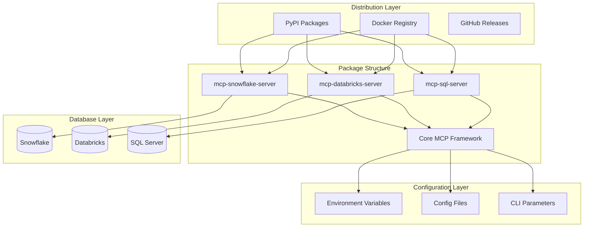
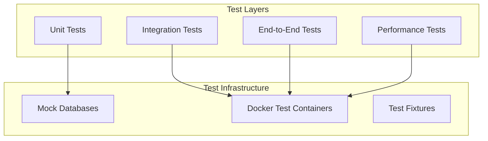

# Design Document

## Overview

This design transforms existing MCP servers (Snowflake, Databricks, SQL Server) into production-ready, distributable packages. The architecture follows modern Python packaging standards using pyproject.toml, implements secure configuration management, and provides multiple deployment options including PyPI packages and Docker containers.

The solution creates three separate but architecturally consistent packages that can be independently installed, configured, and deployed while maintaining a unified API interface for MCP clients.

## Architecture

### High-Level Architecture



### Package Architecture

Each MCP server package follows a standardized structure:

```
mcp-{database}-server/
├── pyproject.toml              # Modern Python packaging
├── README.md                   # Package documentation
├── LICENSE                     # MIT License
├── Dockerfile                  # Container definition
├── docker-compose.yml          # Local development
├── src/
│   └── mcp_{database}_server/
│       ├── __init__.py
│       ├── __main__.py         # CLI entry point
│       ├── server.py           # MCP server implementation
│       ├── config.py           # Configuration management
│       ├── database.py         # Database connection logic
│       └── tools/              # MCP tool implementations
│           ├── __init__.py
│           ├── query.py
│           ├── schema.py
│           └── management.py
├── tests/                      # Comprehensive test suite
├── docs/                       # Documentation
└── examples/                   # Usage examples
```

## Components and Interfaces

### 1. Core MCP Framework

**Purpose**: Shared functionality across all database servers

**Key Components**:
- Base server class with common MCP protocol handling
- Standardized configuration management
- Common error handling and logging
- Shared authentication patterns
- Tool registration and discovery

**Interface**:
```python
class BaseMCPServer:
    def __init__(self, config: ServerConfig)
    def start(self) -> None
    def stop(self) -> None
    def register_tools(self) -> None
    def handle_connection(self) -> None
```

### 2. Configuration Management System

**Purpose**: Unified configuration handling across all servers

**Configuration Hierarchy** (highest to lowest priority):
1. CLI parameters
2. Environment variables  
3. Configuration files
4. Default values

**Configuration Schema**:
```python
@dataclass
class DatabaseConfig:
    host: str
    port: int
    database: str
    username: Optional[str] = None
    password: Optional[str] = None
    auth_method: str = "password"
    ssl_enabled: bool = True
    connection_timeout: int = 30
    pool_size: int = 5

@dataclass  
class ServerConfig:
    database: DatabaseConfig
    server_port: int = 8000
    log_level: str = "INFO"
    debug_mode: bool = False
```

### 3. Database Connection Managers

**Purpose**: Database-specific connection handling with connection pooling

**Snowflake Connection Manager**:
```python
class SnowflakeConnectionManager:
    def __init__(self, config: DatabaseConfig)
    def connect(self) -> snowflake.connector.Connection
    def execute_query(self, query: str) -> Dict[str, Any]
    def get_schema_info(self) -> List[Dict[str, Any]]
    def test_connection(self) -> bool
```

**Databricks Connection Manager**:
```python
class DatabricksConnectionManager:
    def __init__(self, config: DatabaseConfig)
    def connect(self) -> sql.connect.Connection
    def execute_query(self, query: str) -> Dict[str, Any]
    def get_catalog_info(self) -> List[Dict[str, Any]]
    def test_connection(self) -> bool
```

**SQL Server Connection Manager**:
```python
class SQLServerConnectionManager:
    def __init__(self, config: DatabaseConfig)
    def connect(self) -> pyodbc.Connection
    def execute_query(self, query: str) -> Dict[str, Any]
    def get_schema_info(self) -> List[Dict[str, Any]]
    def test_connection(self) -> bool
```

### 4. MCP Tool Implementations

**Purpose**: Standardized MCP tools across all database types

**Common Tools**:
- `execute_query`: Execute SQL queries
- `list_databases`: List available databases
- `list_schemas`: List schemas in a database
- `list_tables`: List tables in a schema
- `get_table_schema`: Get detailed table information
- `test_connection`: Verify database connectivity

**Tool Interface**:
```python
class MCPTool:
    name: str
    description: str
    parameters: Dict[str, Any]
    
    def execute(self, **kwargs) -> Dict[str, Any]
    def validate_parameters(self, **kwargs) -> bool
```

### 5. CLI Interface

**Purpose**: Command-line interface for server management

**Commands**:
```bash
# Start server
mcp-snowflake-server start --config config.yaml
mcp-databricks-server start --port 8001
mcp-sql-server start --host localhost --database mydb

# Test connection
mcp-snowflake-server test-connection
mcp-databricks-server test-connection --token $DATABRICKS_TOKEN

# Generate config template
mcp-snowflake-server init-config > snowflake-config.yaml
```

## Data Models

### Configuration Models

```python
# Environment Variable Mapping
SNOWFLAKE_CONFIG = {
    'SNOWFLAKE_ACCOUNT': 'database.account',
    'SNOWFLAKE_USER': 'database.username', 
    'SNOWFLAKE_PASSWORD': 'database.password',
    'SNOWFLAKE_WAREHOUSE': 'database.warehouse',
    'SNOWFLAKE_DATABASE': 'database.database',
    'SNOWFLAKE_SCHEMA': 'database.schema'
}

DATABRICKS_CONFIG = {
    'DATABRICKS_SERVER_HOSTNAME': 'database.host',
    'DATABRICKS_HTTP_PATH': 'database.http_path',
    'DATABRICKS_ACCESS_TOKEN': 'database.token',
    'DATABRICKS_CATALOG': 'database.catalog',
    'DATABRICKS_SCHEMA': 'database.schema'
}

SQL_SERVER_CONFIG = {
    'SQL_SERVER_HOST': 'database.host',
    'SQL_SERVER_PORT': 'database.port',
    'SQL_SERVER_DATABASE': 'database.database',
    'SQL_SERVER_USERNAME': 'database.username',
    'SQL_SERVER_PASSWORD': 'database.password',
    'SQL_SERVER_DRIVER': 'database.driver'
}
```

### Response Models

```python
@dataclass
class QueryResult:
    columns: List[str]
    rows: List[List[Any]]
    row_count: int
    execution_time: float
    
@dataclass
class SchemaInfo:
    database_name: str
    schema_name: str
    tables: List[TableInfo]
    
@dataclass
class TableInfo:
    name: str
    schema: str
    columns: List[ColumnInfo]
    row_count: Optional[int] = None
    
@dataclass
class ColumnInfo:
    name: str
    data_type: str
    nullable: bool
    default_value: Optional[str] = None
```

## Error Handling

### Error Categories

1. **Configuration Errors**: Invalid or missing configuration
2. **Connection Errors**: Database connectivity issues
3. **Authentication Errors**: Invalid credentials or permissions
4. **Query Errors**: SQL syntax or execution errors
5. **MCP Protocol Errors**: Invalid MCP requests or responses

### Error Response Format

```python
@dataclass
class MCPError:
    code: str
    message: str
    details: Optional[Dict[str, Any]] = None
    
# Standard error codes
ERROR_CODES = {
    'CONFIG_INVALID': 'Invalid configuration provided',
    'CONNECTION_FAILED': 'Failed to connect to database',
    'AUTH_FAILED': 'Authentication failed',
    'QUERY_FAILED': 'Query execution failed',
    'PERMISSION_DENIED': 'Insufficient permissions'
}
```

### Logging Strategy

```python
# Structured logging with different levels
import structlog

logger = structlog.get_logger()

# Connection events
logger.info("database_connection_established", 
           database_type="snowflake", 
           host="account.snowflakecomputing.com")

# Query execution
logger.debug("query_executed", 
            query_hash="abc123", 
            execution_time=1.23, 
            row_count=150)

# Error logging (with credential masking)
logger.error("authentication_failed", 
            database_type="databricks",
            host="workspace.cloud.databricks.com",
            error_code="AUTH_FAILED")
```

## Testing Strategy

### Test Architecture



### Test Categories

1. **Unit Tests** (90%+ coverage target)
   - Configuration parsing and validation
   - Tool parameter validation
   - Error handling logic
   - Connection manager methods

2. **Integration Tests**
   - Database connection establishment
   - Query execution with mock responses
   - MCP protocol compliance
   - Configuration loading from various sources

3. **End-to-End Tests**
   - Full server startup and shutdown
   - Complete MCP request/response cycles
   - Multi-client connection handling
   - Error recovery scenarios

4. **Performance Tests**
   - Connection pool efficiency
   - Query response times
   - Memory usage under load
   - Concurrent connection handling

### Mock Database Strategy

```python
# Use pytest fixtures with mock databases
@pytest.fixture
def mock_snowflake_connection():
    with patch('snowflake.connector.connect') as mock_connect:
        mock_conn = Mock()
        mock_conn.execute.return_value = Mock()
        mock_connect.return_value = mock_conn
        yield mock_conn

@pytest.fixture  
def test_server_config():
    return ServerConfig(
        database=DatabaseConfig(
            host="test.snowflakecomputing.com",
            username="test_user",
            password="test_pass",
            database="test_db"
        )
    )
```

## Deployment Architecture

### PyPI Distribution

**Package Structure**:
- Use `pyproject.toml` for modern Python packaging
- Include all dependencies with version pinning
- Provide console script entry points
- Include comprehensive metadata

**pyproject.toml Example**:
```toml
[build-system]
requires = ["hatchling"]
build-backend = "hatchling.build"

[project]
name = "mcp-snowflake-server"
version = "1.0.0"
description = "MCP server for Snowflake database connectivity"
authors = [{name = "Your Name", email = "your.email@example.com"}]
license = {text = "MIT"}
dependencies = [
    "snowflake-connector-python>=3.0.0",
    "mcp>=1.0.0",
    "pydantic>=2.0.0",
    "click>=8.0.0",
    "pyyaml>=6.0.0"
]

[project.scripts]
mcp-snowflake-server = "mcp_snowflake_server.__main__:main"
```

### Docker Containerization

**Multi-stage Dockerfile Strategy**:
```dockerfile
# Build stage
FROM python:3.11-slim as builder
WORKDIR /app
COPY pyproject.toml .
RUN pip install build && python -m build

# Runtime stage  
FROM python:3.11-slim
WORKDIR /app
COPY --from=builder /app/dist/*.whl .
RUN pip install *.whl && rm *.whl

# Security: non-root user
RUN useradd --create-home --shell /bin/bash mcp
USER mcp

EXPOSE 8000
CMD ["mcp-snowflake-server", "start"]
```

### CI/CD Pipeline

**GitHub Actions Workflow**:
1. **Test Stage**: Run all test suites on multiple Python versions
2. **Build Stage**: Create PyPI packages and Docker images
3. **Security Stage**: Scan for vulnerabilities
4. **Publish Stage**: Deploy to PyPI and Docker Hub on tagged releases

**Pipeline Configuration**:
```yaml
name: CI/CD Pipeline
on: [push, pull_request]

jobs:
  test:
    runs-on: ubuntu-latest
    strategy:
      matrix:
        python-version: [3.9, 3.10, 3.11, 3.12]
    steps:
      - uses: actions/checkout@v4
      - name: Set up Python
        uses: actions/setup-python@v4
        with:
          python-version: ${{ matrix.python-version }}
      - name: Run tests
        run: |
          pip install -e .[test]
          pytest --cov=src --cov-report=xml
          
  build-and-publish:
    needs: test
    if: github.event_name == 'push' && startsWith(github.ref, 'refs/tags/')
    runs-on: ubuntu-latest
    steps:
      - name: Build and publish to PyPI
        run: |
          python -m build
          twine upload dist/*
      - name: Build and push Docker image
        run: |
          docker build -t mcp-snowflake-server:${{ github.ref_name }} .
          docker push mcp-snowflake-server:${{ github.ref_name }}
```

This design provides a robust, scalable foundation for distributing MCP servers while maintaining security, consistency, and ease of use across all three database platforms.