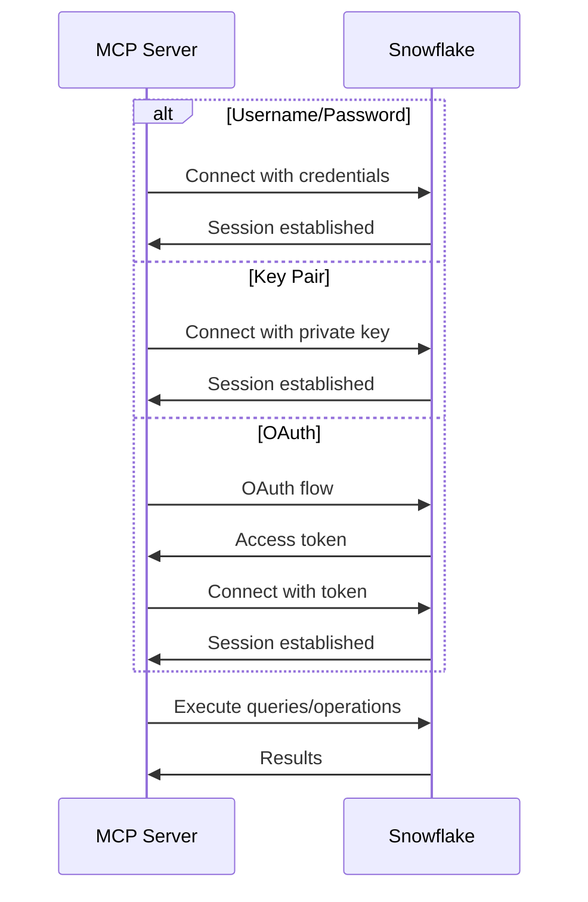
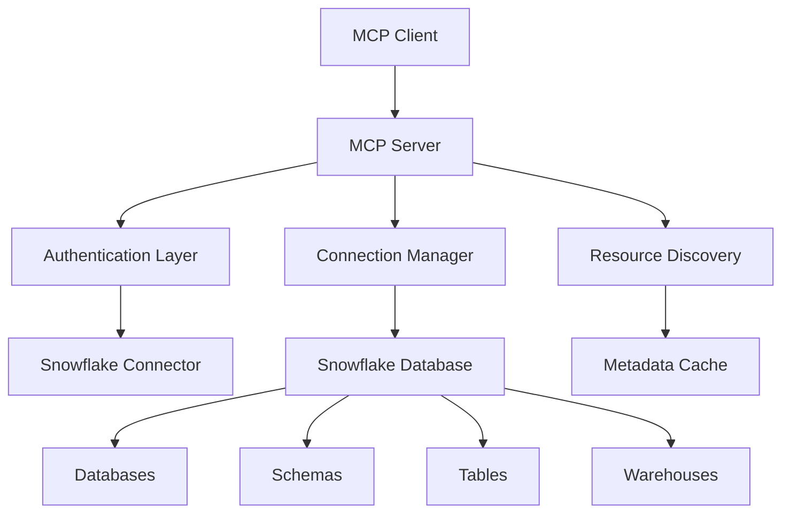

# Design Document

## Overview

The Snowflake MCP Server will provide a standardized Model Context Protocol interface for interacting with Snowflake resources. The server will follow the same architectural patterns as the existing Databricks and Fabric MCP servers, providing tools for SQL query execution, resource management, and data operations across Snowflake databases, schemas, tables, and warehouses.

The server will be implemented as a Python-based MCP server using the `mcp` library, with authentication handled through Snowflake's native authentication methods including username/password, key pair authentication, and OAuth. The design emphasizes consistency with existing MCP servers while accommodating Snowflake-specific features and authentication requirements.

## Architecture

### Core Components

1. **MCP Server Framework**
   - Built on the `mcp.server` library
   - Implements standard MCP protocol for tool registration and execution
   - Provides async tool execution with proper error handling

2. **Authentication Layer**
   - Snowflake connector integration using `snowflake-connector-python`
   - Support for username/password authentication
   - Support for key pair authentication (private key)
   - Support for OAuth authentication flows
   - Connection pooling and session management

3. **Snowflake Connection Manager**
   - Connection pooling for efficient resource usage
   - Session management with automatic reconnection
   - Query execution with proper timeout handling
   - Transaction management for data operations

4. **Resource Discovery Engine**
   - Database, schema, and table enumeration
   - Warehouse management and status monitoring
   - Metadata extraction and caching
   - Permission-aware resource listing

5. **Configuration Management**
   - YAML-based configuration similar to existing servers
   - Environment variable support for sensitive data
   - Validation of required configuration parameters
   - Support for multiple authentication methods

### Authentication Flow



### Data Flow Architecture



## Components and Interfaces

### Configuration Schema

```yaml
snowflake:
  # Connection configuration
  account: "your-account.snowflakecomputing.com"
  user: "your-username"
  
  # Authentication method (choose one)
  # Method 1: Password authentication
  password: "your-password"  # or use environment variable
  
  # Method 2: Key pair authentication
  private_key_path: "/path/to/private_key.p8"
  private_key_passphrase: "key-passphrase"  # optional
  
  # Method 3: OAuth (for future implementation)
  # oauth_token: "oauth-access-token"
  
  # Default connection settings
  database: "default-database"
  schema: "default-schema"
  warehouse: "default-warehouse"
  role: "default-role"  # optional
  
  # Connection settings
  timeout: 120
  max_retries: 3
  retry_delay: 5
  
  # Connection pool settings
  pool_size: 5
  pool_timeout: 30
```

### Core Tool Interfaces

1. **Query Execution Tools**
   - `execute_query`: Execute SQL against Snowflake database
   - `execute_query_with_warehouse`: Execute with specific warehouse
   - `get_query_history`: Get recent query execution history

2. **Resource Discovery Tools**
   - `list_databases`: List accessible databases
   - `list_schemas`: List schemas in database
   - `list_tables`: List tables in schema
   - `list_warehouses`: List available warehouses
   - `get_table_schema`: Get table schema information

3. **Data Management Tools**
   - `create_table`: Create new table
   - `insert_data`: Insert data into existing table
   - `describe_table`: Get comprehensive table metadata
   - `get_table_ddl`: Get table DDL statement

4. **Warehouse Management Tools**
   - `get_warehouse_status`: Get warehouse status and size
   - `start_warehouse`: Start/resume warehouse
   - `stop_warehouse`: Suspend warehouse
   - `resize_warehouse`: Change warehouse size

### Connection Manager Interface

```python
class SnowflakeConnectionManager:
    def __init__(self, config: Dict[str, Any]):
        self.config = config
        self.connection_pool = None
        self.current_connection = None
    
    async def get_connection(self) -> snowflake.connector.SnowflakeConnection:
        """Get connection from pool or create new one"""
        pass
    
    async def execute_query(self, query: str, warehouse: Optional[str] = None) -> Dict:
        """Execute query with proper error handling"""
        pass
    
    async def close_connections(self):
        """Close all connections in pool"""
        pass
```

### Resource Discovery Interface

```python
class SnowflakeResourceDiscovery:
    def __init__(self, connection_manager: SnowflakeConnectionManager):
        self.connection_manager = connection_manager
        self.metadata_cache = {}
    
    async def list_databases(self) -> List[Dict]:
        """Get list of accessible databases"""
        pass
    
    async def list_schemas(self, database: str) -> List[Dict]:
        """Get schemas in database"""
        pass
    
    async def list_tables(self, database: str, schema: str) -> List[Dict]:
        """Get tables in schema"""
        pass
    
    async def get_table_info(self, database: str, schema: str, table: str) -> Dict:
        """Get detailed table information"""
        pass
```

## Data Models

### Configuration Model

```python
@dataclass
class SnowflakeConfig:
    account: str
    user: str
    password: Optional[str] = None
    private_key_path: Optional[str] = None
    private_key_passphrase: Optional[str] = None
    database: Optional[str] = None
    schema: Optional[str] = None
    warehouse: Optional[str] = None
    role: Optional[str] = None
    timeout: int = 120
    max_retries: int = 3
    retry_delay: int = 5
    pool_size: int = 5
    pool_timeout: int = 30
```

### Resource Models

```python
@dataclass
class Database:
    name: str
    owner: str
    comment: Optional[str]
    created_on: datetime
    retention_time: int

@dataclass
class Schema:
    name: str
    database_name: str
    owner: str
    comment: Optional[str]
    created_on: datetime

@dataclass
class Table:
    name: str
    database_name: str
    schema_name: str
    kind: str  # TABLE, VIEW, etc.
    comment: Optional[str]
    rows: Optional[int]
    bytes: Optional[int]
    created_on: datetime

@dataclass
class Warehouse:
    name: str
    state: str  # STARTED, SUSPENDED, etc.
    type: str   # STANDARD, SNOWPARK-OPTIMIZED
    size: str   # X-SMALL, SMALL, MEDIUM, etc.
    running: bool
    queued: int
    is_default: bool
    auto_suspend: int
    auto_resume: bool
```

### Response Models

```python
@dataclass
class QueryResult:
    success: bool
    columns: List[str]
    data: List[Dict[str, Any]]
    row_count: int
    query_type: str
    execution_time: Optional[float]
    warehouse_used: Optional[str]
    query_id: Optional[str]
    error: Optional[str]
    error_type: Optional[str]
```

## Error Handling

### Error Categories

1. **Authentication Errors**
   - Invalid credentials
   - Expired passwords/keys
   - Insufficient permissions
   - Account/user issues

2. **Connection Errors**
   - Network connectivity issues
   - Account URL problems
   - Timeout errors
   - SSL/TLS issues

3. **Resource Errors**
   - Database/schema not found
   - Table not accessible
   - Warehouse not available
   - Permission denied

4. **Query Execution Errors**
   - SQL syntax errors
   - Data type mismatches
   - Constraint violations
   - Resource limits exceeded

5. **Warehouse Errors**
   - Warehouse suspended
   - Insufficient credits
   - Size limits exceeded
   - Auto-suspend conflicts

### Error Response Format

```json
{
  "success": false,
  "error": "Human-readable error message",
  "error_type": "AuthenticationError|ConnectionError|ResourceError|QueryError|WarehouseError",
  "error_code": "SF_001",
  "details": {
    "database": "optional-database-name",
    "schema": "optional-schema-name",
    "warehouse": "optional-warehouse-name",
    "query_id": "optional-query-id",
    "timestamp": "2024-01-01T12:00:00Z"
  },
  "retry_after": 30
}
```

### Retry Strategy

- Exponential backoff for transient errors
- Maximum 3 retry attempts by default
- Different retry logic for different error types:
  - Connection errors: Exponential backoff with jitter
  - Warehouse startup: Linear backoff with longer delays
  - Rate limiting: Respect Snowflake's rate limits
  - Authentication errors: No retry (immediate failure)

## Testing Strategy

### Unit Testing

1. **Authentication Tests**
   - Username/password authentication
   - Key pair authentication
   - Error handling for invalid credentials

2. **Connection Manager Tests**
   - Connection pooling functionality
   - Query execution with different parameters
   - Error recovery and reconnection

3. **Resource Discovery Tests**
   - Database/schema/table listing
   - Metadata extraction and caching
   - Permission-based filtering

4. **Query Execution Tests**
   - SELECT query result formatting
   - DML/DDL operation handling
   - Error response formatting

### Integration Testing

1. **End-to-End Workflow Tests**
   - Complete authentication to query execution flow
   - Multi-resource operations
   - Warehouse management scenarios

2. **Snowflake Integration Tests**
   - Real connections with test account
   - Resource discovery operations
   - Query execution against test data

3. **MCP Protocol Tests**
   - Tool registration and discovery
   - Tool execution with various parameters
   - Error response formatting

### Performance Testing

1. **Query Performance Tests**
   - Large result set handling
   - Query timeout scenarios
   - Concurrent query execution

2. **Connection Pool Tests**
   - Pool efficiency under load
   - Connection reuse patterns
   - Pool exhaustion scenarios

### Test Environment Setup

- Dedicated test Snowflake account
- Test databases and schemas with sample data
- Service account with minimal required permissions
- Automated test data setup and cleanup

## Security Considerations

### Authentication Security

- Store passwords and private keys in environment variables or secure vaults
- Support for encrypted private keys with passphrases
- Use least-privilege principle for user permissions
- Support for role-based access control

### Data Security

- No logging of sensitive data or query results
- Secure handling of connection strings and credentials
- Proper cleanup of temporary resources
- Audit logging for administrative operations

### Network Security

- HTTPS-only communication with Snowflake
- Certificate validation
- Support for proxy configurations
- Network timeout configurations

## Dependencies

### Core Dependencies

```
mcp>=1.0.0
snowflake-connector-python>=3.6.0
cryptography>=41.0.0  # For key pair authentication
pyyaml>=6.0.1
asyncio
typing-extensions>=4.8.0
```

### Optional Dependencies

```
snowflake-sqlalchemy>=1.5.0  # For advanced SQL operations
pandas>=2.0.0  # For data frame operations
pyarrow>=14.0.0  # For optimized data transfer
prometheus-client>=0.19.0  # For metrics collection
```

### Development Dependencies

```
pytest>=7.4.0
pytest-asyncio>=0.21.0
pytest-mock>=3.12.0
black>=23.0.0
mypy>=1.7.0
```

## Snowflake-Specific Features

### Warehouse Management

- Automatic warehouse startup for queries
- Warehouse size optimization recommendations
- Cost tracking and monitoring integration
- Multi-cluster warehouse support

### Data Types

- Comprehensive Snowflake data type mapping
- VARIANT/OBJECT/ARRAY type handling
- Semi-structured data query support
- Time travel query capabilities

### Performance Optimization

- Query result caching
- Warehouse auto-suspend configuration
- Connection pooling for efficiency
- Batch operation support

### Advanced Features

- Stored procedure execution support
- User-defined function (UDF) management
- Stream and task monitoring
- Data sharing capabilities (future enhancement)