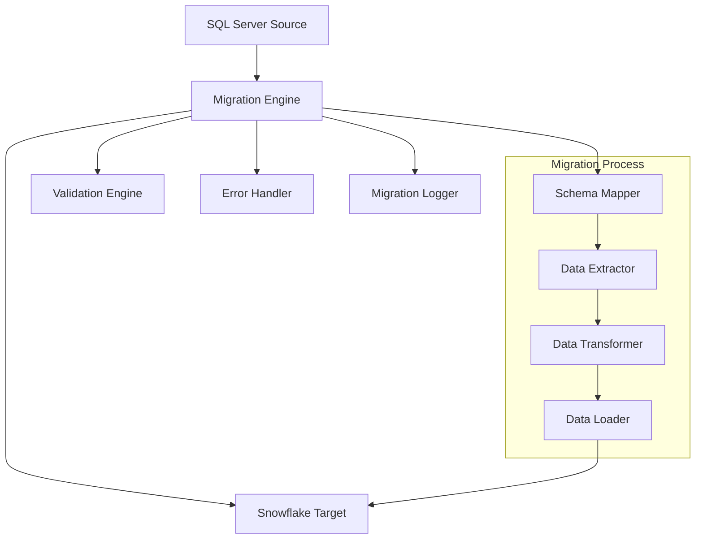
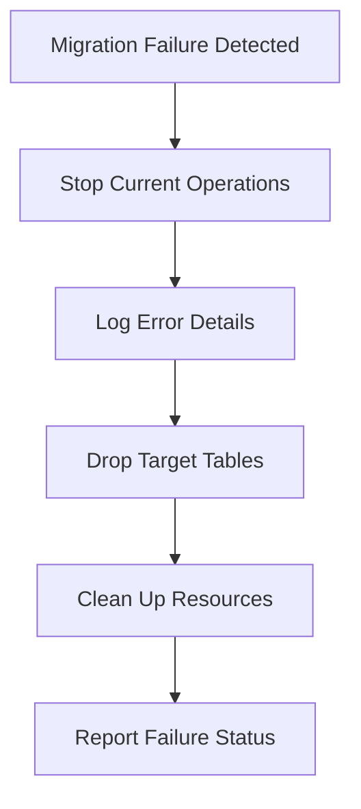

# Design Document

## Overview

The SQL Server to Snowflake migration system is designed to automate the transfer of customers and orders tables from an on-premises SQL Server database to Snowflake's cloud data warehouse. The system will preserve data integrity while adding migration metadata for tracking purposes.

## Architecture

### High-Level Architecture



### Component Architecture

The migration system consists of several key components:

1. **Connection Managers**: Handle database connections for both SQL Server and Snowflake
2. **Schema Analyzer**: Analyzes source table structures and maps them to Snowflake equivalents
3. **Migration Engine**: Orchestrates the entire migration process
4. **Data Transformer**: Handles data type conversions and adds metadata columns
5. **Validation Engine**: Ensures data integrity and completeness
6. **Error Handler**: Manages error scenarios and rollback operations

## Components and Interfaces

### 1. Database Connection Interface

```python
class DatabaseConnection:
    async def connect() -> bool
    async def disconnect() -> bool
    async def execute_query(query: str) -> Dict[str, Any]
    async def get_table_schema(table_name: str) -> Dict[str, Any]
```

### 2. Migration Engine

```python
class MigrationEngine:
    def __init__(sql_connection, snowflake_connection)
    async def migrate_table(source_table: str, target_table: str) -> MigrationResult
    async def validate_migration(source_table: str, target_table: str) -> ValidationResult
    async def rollback_migration(target_table: str) -> bool
```

### 3. Schema Mapper

```python
class SchemaMapper:
    def map_sql_server_to_snowflake(sql_schema: Dict) -> Dict
    def add_metadata_columns(schema: Dict) -> Dict
    def generate_create_table_sql(schema: Dict, table_name: str) -> str
```

### 4. Data Transformer

```python
class DataTransformer:
    def transform_row(row: Dict, schema_mapping: Dict) -> Dict
    def add_migration_metadata(row: Dict) -> Dict
    def batch_transform(rows: List[Dict]) -> List[Dict]
```

## Data Models

### Source Table Schemas

#### Customers Table (SQL Server)
- CustomerID: nvarchar(50) NOT NULL
- CompanyName: nvarchar(255) NOT NULL
- ContactName: nvarchar(100) NULL
- ContactTitle: nvarchar(50) NULL
- Address: nvarchar(255) NULL
- City: nvarchar(50) NULL
- Region: nvarchar(50) NULL
- PostalCode: nvarchar(20) NULL
- Country: nvarchar(50) NULL
- Phone: nvarchar(30) NULL
- Fax: nvarchar(30) NULL
- Email: nvarchar(100) NULL
- IsActive: bit NULL

#### Orders Table (SQL Server)
- OrderID: int NOT NULL
- CustomerID: nvarchar(50) NOT NULL
- OrderDate: datetime2 NOT NULL
- RequiredDate: datetime2 NULL
- ShippedDate: datetime2 NULL
- ShipVia: int NULL
- Freight: decimal(10,2) NULL
- ShipName: nvarchar(100) NULL
- ShipAddress: nvarchar(255) NULL
- ShipCity: nvarchar(50) NULL
- ShipRegion: nvarchar(50) NULL
- ShipPostalCode: nvarchar(20) NULL
- ShipCountry: nvarchar(50) NULL
- OrderStatus: nvarchar(20) NULL
- CreatedDate: datetime2 NULL
- ModifiedDate: datetime2 NULL

### Target Table Schemas (Snowflake)

#### Customers Table (Snowflake)
- All original columns with Snowflake data type mappings:
  - nvarchar → VARCHAR
  - bit → BOOLEAN
- Additional metadata columns:
  - is_migrated: INTEGER NOT NULL DEFAULT 1
  - migrated_at: TIMESTAMP_NTZ NOT NULL

#### Orders Table (Snowflake)
- All original columns with Snowflake data type mappings:
  - int → INTEGER
  - nvarchar → VARCHAR
  - datetime2 → TIMESTAMP_NTZ
  - decimal → NUMBER
- Additional metadata columns:
  - is_migrated: INTEGER NOT NULL DEFAULT 1
  - migrated_at: TIMESTAMP_NTZ NOT NULL

### Data Type Mapping

| SQL Server Type | Snowflake Type | Notes |
|----------------|----------------|-------|
| nvarchar(n) | VARCHAR(n) | Direct mapping |
| int | INTEGER | Direct mapping |
| bit | BOOLEAN | Direct mapping |
| datetime2 | TIMESTAMP_NTZ | No timezone conversion |
| decimal(p,s) | NUMBER(p,s) | Precision and scale preserved |

## Error Handling

### Error Categories

1. **Connection Errors**: Network issues, authentication failures
2. **Schema Errors**: Missing tables, incompatible data types
3. **Data Errors**: Constraint violations, data truncation
4. **System Errors**: Memory issues, timeout errors

### Error Handling Strategy

1. **Retry Logic**: Implement exponential backoff for transient errors
2. **Rollback Mechanism**: Drop target tables if migration fails
3. **Error Logging**: Detailed logging for troubleshooting
4. **Graceful Degradation**: Continue with remaining tables if one fails

### Rollback Strategy



## Testing Strategy

### Unit Testing
- Test individual components (schema mapper, data transformer)
- Mock database connections for isolated testing
- Validate data type conversions

### Integration Testing
- Test end-to-end migration with sample data
- Validate error handling scenarios
- Test rollback functionality

### Performance Testing
- Test with large datasets to ensure scalability
- Monitor memory usage during batch processing
- Validate timeout handling

### Data Validation Testing
- Compare record counts between source and target
- Validate data integrity after migration
- Test metadata column population

## Security Considerations

1. **Connection Security**: Use encrypted connections for both databases
2. **Credential Management**: Store credentials securely, avoid hardcoding
3. **Data Privacy**: Ensure no sensitive data is logged
4. **Access Control**: Implement proper database permissions

## Performance Optimization

1. **Batch Processing**: Process data in configurable batch sizes
2. **Parallel Processing**: Use async operations for concurrent table migrations
3. **Memory Management**: Stream large datasets to avoid memory issues
4. **Connection Pooling**: Reuse database connections efficiently

## Monitoring and Logging

### Migration Metrics
- Records processed per second
- Total migration time
- Error rates by category
- Data validation results

### Logging Strategy
- Structured logging with correlation IDs
- Different log levels (DEBUG, INFO, WARN, ERROR)
- Separate logs for migration progress and errors
- Performance metrics logging