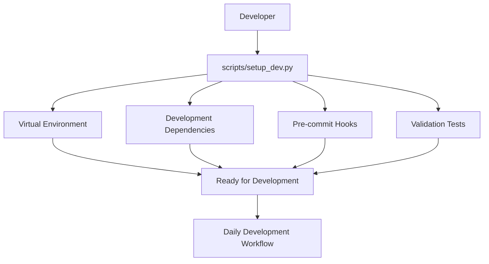
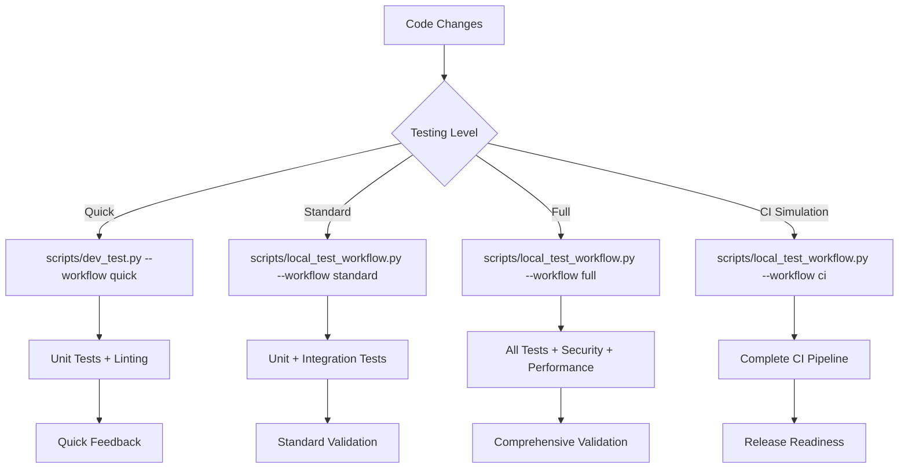
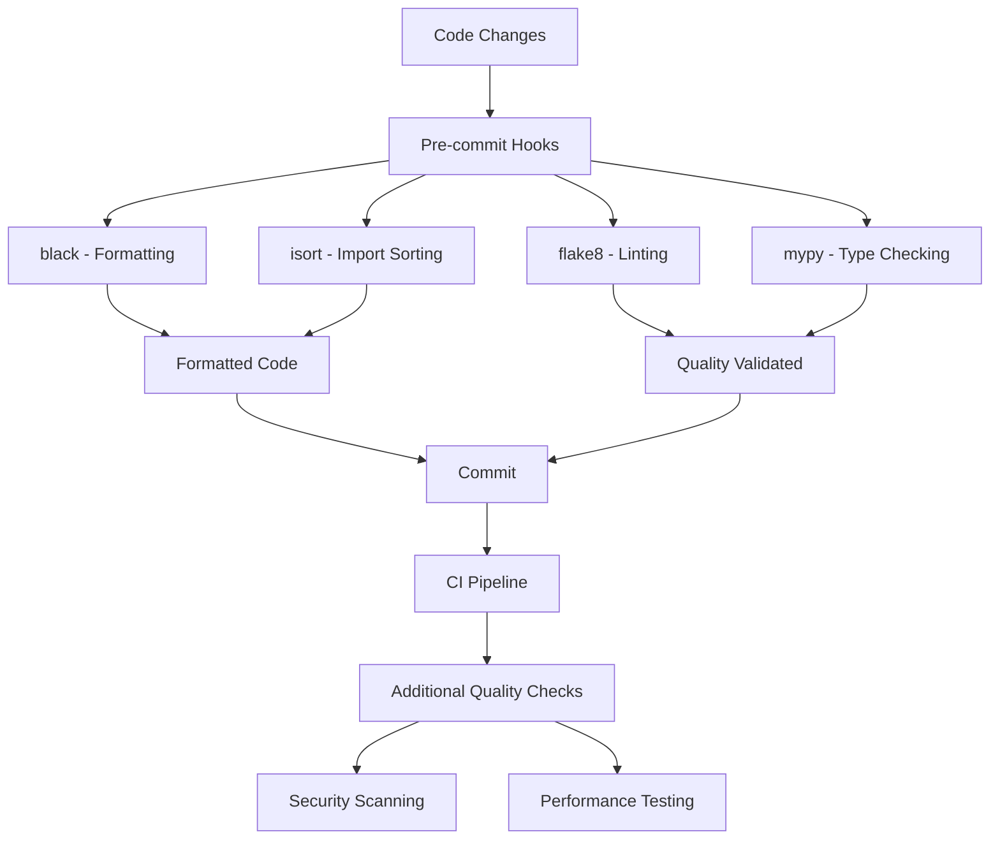
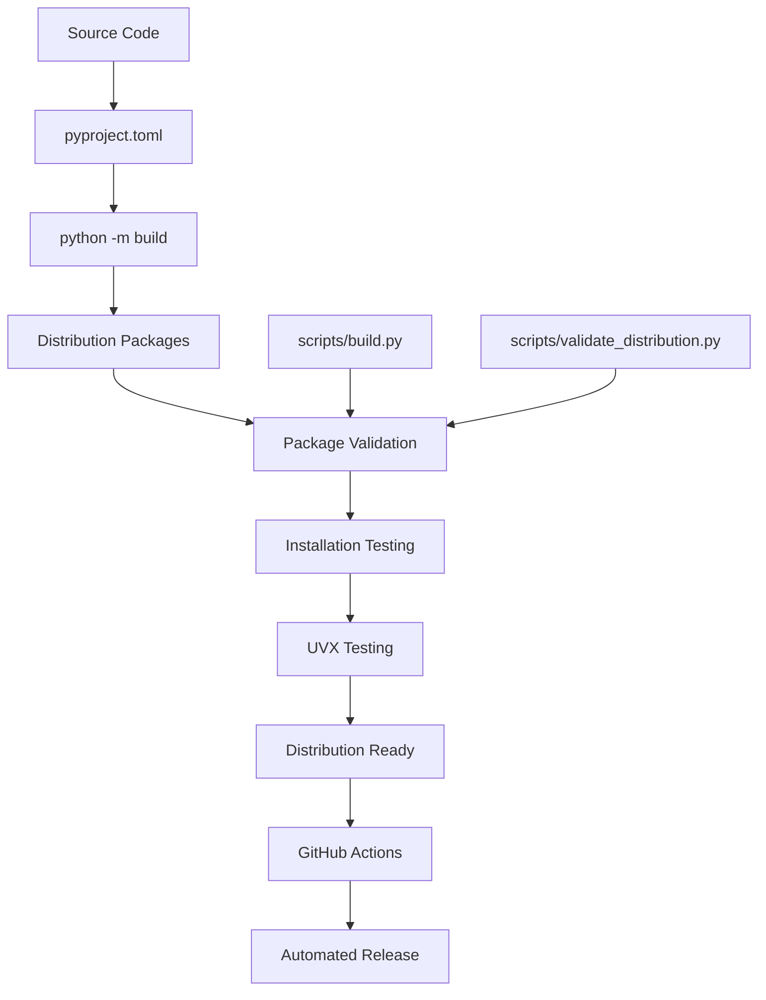

# Development and Testing Integration Guide

This document explains how all the development and testing components work together to provide a comprehensive development experience for the databricks-mcp-server project.

## Overview

The development environment consists of multiple integrated components:

1. **Setup Scripts** - Automated environment setup
2. **Testing Workflows** - Local and CI testing
3. **Code Quality Tools** - Formatting, linting, type checking
4. **Build System** - Package building and distribution
5. **Documentation** - Comprehensive guides and examples

## Component Integration

### 1. Development Setup Integration



**Integration Points**:
- `scripts/setup_dev.py` orchestrates complete environment setup
- `Makefile` provides convenient shortcuts (`make dev-install`)
- `pyproject.toml` defines development dependencies
- `.pre-commit-config.yaml` configures quality checks

### 2. Testing Workflow Integration



**Integration Points**:
- Multiple testing scripts with different scopes
- Shared configuration in `pytest.ini` and `pyproject.toml`
- Common utilities and test fixtures
- Consistent reporting and output formatting

### 3. Code Quality Integration



**Integration Points**:
- `.pre-commit-config.yaml` defines hook configuration
- `pyproject.toml` contains tool configurations
- `Makefile` provides quality check shortcuts
- CI workflows run the same checks

### 4. Build and Distribution Integration



**Integration Points**:
- `pyproject.toml` defines package metadata and build configuration
- `scripts/build.py` handles build automation
- `scripts/validate_distribution.py` validates packages
- GitHub Actions automate release process

## Workflow Integration Patterns

### 1. Daily Development Pattern

```bash
# Morning setup
source .venv/bin/activate
git pull origin develop

# Development cycle (repeat)
# 1. Make changes
# 2. Quick validation
make dev-quick
# 3. Fix issues
# 4. Continue development

# Before commit
make dev-full
git add .
git commit -m "feat: description"
```

**Tools Used**:
- `scripts/dev_test.py` for quick feedback
- `Makefile` for convenient commands
- Pre-commit hooks for automatic quality checks
- `pytest` for test execution

### 2. Feature Development Pattern

```bash
# Start feature
git checkout -b feature/new-feature
python scripts/setup_dev.py  # Ensure clean environment

# Test-driven development
# 1. Write failing test
pytest tests/test_new_feature.py::test_functionality -v
# 2. Implement feature
# 3. Run test until passing
# 4. Refactor

# Comprehensive validation
python scripts/local_test_workflow.py --workflow full

# Integration testing
python run_integration_tests.py

# Ready for PR
git push origin feature/new-feature
```

**Tools Used**:
- `scripts/setup_dev.py` for environment consistency
- `pytest` with markers for targeted testing
- `scripts/local_test_workflow.py` for comprehensive validation
- `run_integration_tests.py` for end-to-end testing

### 3. Release Preparation Pattern

```bash
# Pre-release validation
python scripts/local_test_workflow.py --workflow release

# Version management
python scripts/bump_version.py minor

# Final validation
make ci  # Complete CI simulation

# Release
git tag v1.2.0
git push origin v1.2.0  # Triggers automated release
```

**Tools Used**:
- `scripts/local_test_workflow.py` for release validation
- `scripts/bump_version.py` for version management
- `Makefile` for CI simulation
- GitHub Actions for automated release

## Configuration Integration

### 1. Python Package Configuration (`pyproject.toml`)

```toml
[build-system]
requires = ["hatchling"]
build-backend = "hatchling.build"

[project]
name = "databricks-mcp-server"
# ... project metadata ...

dependencies = [
    # Runtime dependencies
]

[project.optional-dependencies]
dev = [
    # Development dependencies
    "pytest>=7.0.0",
    "black>=23.0.0",
    "isort>=5.12.0",
    "flake8>=6.0.0",
    "mypy>=1.0.0",
    # ... more dev dependencies
]

[project.scripts]
databricks-mcp-server = "databricks_mcp_server.main:main"

[tool.black]
line-length = 88
target-version = ["py38"]

[tool.isort]
profile = "black"

[tool.mypy]
python_version = "3.8"
strict = true

[tool.pytest.ini_options]
minversion = "7.0"
testpaths = ["tests"]
markers = [
    "unit: Unit tests",
    "integration: Integration tests",
    "slow: Slow tests",
    "requires_uvx: Tests requiring uvx"
]
```

### 2. Make Configuration (`Makefile`)

Provides convenient shortcuts for all development tasks:

```makefile
# Quick development workflows
dev-quick: format lint test-unit
dev-full: format lint test-all build test-install
dev-ci: clean lint test-all build test-install test-uvx validate-dist

# Individual components
format: black isort
lint: flake8 mypy
test: pytest-unit
test-all: pytest-all
build: python-build
```

### 3. CI/CD Configuration (`.github/workflows/`)

Multiple workflows for different purposes:

- **`build.yml`** - Main build and test workflow
- **`development.yml`** - Development-focused workflow
- **`release.yml`** - Automated release workflow
- **`validate-distribution.yml`** - Distribution validation

### 4. Pre-commit Configuration (`.pre-commit-config.yaml`)

Ensures code quality on every commit:

```yaml
repos:
  - repo: https://github.com/psf/black
    rev: 23.3.0
    hooks:
      - id: black
  - repo: https://github.com/pycqa/isort
    rev: 5.12.0
    hooks:
      - id: isort
  - repo: https://github.com/pycqa/flake8
    rev: 6.0.0
    hooks:
      - id: flake8
```

## Testing Integration Architecture

### 1. Test Categories and Markers

```python
# Unit tests - fast, isolated
@pytest.mark.unit
def test_config_loading():
    pass

# Integration tests - end-to-end
@pytest.mark.integration
def test_server_startup():
    pass

# Slow tests - package building, installation
@pytest.mark.slow
def test_package_installation():
    pass

# UVX-specific tests
@pytest.mark.requires_uvx
def test_uvx_installation():
    pass
```

### 2. Test Execution Strategies

```bash
# Development testing (fast feedback)
pytest -m "unit"                    # Unit tests only
pytest -m "not slow"                # Exclude slow tests
pytest -m "unit or integration"     # Core functionality

# Comprehensive testing
pytest                              # All tests
pytest -m "slow"                    # Package/installation tests
pytest --cov=databricks_mcp_server  # With coverage

# Targeted testing
pytest tests/test_config.py         # Specific module
pytest -k "config"                  # Pattern matching
```

### 3. Coverage Integration

```bash
# Generate coverage reports
pytest --cov=databricks_mcp_server --cov-report=html --cov-report=term-missing

# Coverage files generated:
# - .coverage (data file)
# - htmlcov/ (HTML report)
# - coverage.xml (XML for CI)
```

## Documentation Integration

### 1. Documentation Structure

```
docs/
├── README.md                    # Main usage documentation
├── DEVELOPMENT.md               # Comprehensive development guide
├── DEVELOPMENT_SETUP.md         # Setup-focused guide
├── DEVELOPMENT_WORKFLOW.md      # Workflow-focused guide
├── DEVELOPMENT_INTEGRATION.md   # This document
├── CONTRIBUTING.md              # Contribution guidelines
├── INTEGRATION_TESTING.md       # Testing documentation
├── BUILD_AND_DISTRIBUTION.md    # Build process
├── TROUBLESHOOTING.md           # Common issues
└── ENVIRONMENT_VARIABLES.md     # Configuration reference
```

### 2. Documentation Integration Points

- **README.md** - Links to all other documentation
- **Setup scripts** - Reference setup documentation
- **Testing scripts** - Include help and usage information
- **CI workflows** - Generate documentation artifacts
- **Code examples** - Consistent with documentation

## Automation Integration

### 1. Local Automation

```bash
# Makefile targets
make dev-install    # Setup environment
make dev-quick      # Quick development workflow
make dev-full       # Full development workflow
make dev-ci         # CI simulation

# Python scripts
python scripts/setup_dev.py              # Environment setup
python scripts/dev_test.py               # Development testing
python scripts/local_test_workflow.py    # Local testing workflows
python scripts/build.py                  # Build automation
python scripts/validate_distribution.py  # Distribution validation
```

### 2. CI/CD Automation

```yaml
# GitHub Actions integration
- Development workflow (feature branches)
- Build workflow (main branches)
- Release workflow (tags)
- Distribution validation (scheduled)
```

### 3. Quality Automation

```bash
# Pre-commit hooks (automatic)
- Code formatting (black, isort)
- Linting (flake8)
- Type checking (mypy)

# CI quality checks
- Security scanning (pip-audit, bandit)
- Performance testing
- Cross-platform validation
- Documentation validation
```

## Best Practices for Integration

### 1. Consistency

- **Same tools everywhere** - Local and CI use identical tools
- **Same configuration** - Shared configuration files
- **Same commands** - Makefile provides consistent interface
- **Same validation** - Local workflows match CI workflows

### 2. Efficiency

- **Layered testing** - Quick feedback first, comprehensive later
- **Parallel execution** - CI runs tests in parallel
- **Caching** - Dependencies and build artifacts cached
- **Incremental** - Only run necessary tests when possible

### 3. Reliability

- **Deterministic** - Tests produce consistent results
- **Isolated** - Tests don't depend on external services
- **Comprehensive** - All code paths tested
- **Validated** - Package installation tested on multiple platforms

### 4. Maintainability

- **Documented** - All processes documented
- **Automated** - Manual steps minimized
- **Modular** - Components can be used independently
- **Extensible** - Easy to add new tools and workflows

## Troubleshooting Integration Issues

### 1. Environment Inconsistencies

```bash
# Clean and reset environment
rm -rf .venv
python scripts/setup_dev.py --force

# Verify environment
python scripts/local_test_workflow.py --prereq
```

### 2. Test Failures

```bash
# Run specific test categories
pytest -m unit -v                    # Unit tests only
pytest -m integration -v             # Integration tests only
pytest tests/test_specific.py -v     # Specific test file

# Debug test failures
pytest --pdb tests/test_failing.py   # Interactive debugging
pytest -s tests/test_failing.py      # Show print statements
```

### 3. Build Issues

```bash
# Clean build
make clean build

# Verbose build
python -m build --verbose

# Test installation
python scripts/build.py --test-install
```

### 4. CI/Local Differences

```bash
# Simulate CI locally
python scripts/local_test_workflow.py --workflow ci

# Check environment differences
python -c "import sys; print(sys.version)"
python -c "import platform; print(platform.platform())"
```

This integration guide ensures all development and testing components work together seamlessly, providing a robust and efficient development experience.